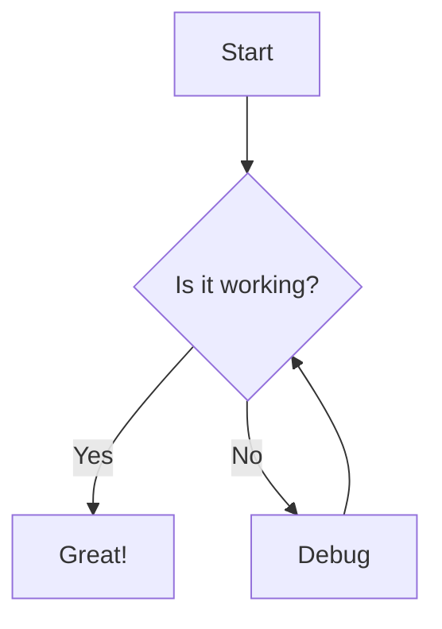

# Technical Implementation

## Summary

This chapter covers the technical aspects of MicroSim development including JavaScript libraries, responsive design, accessibility, and analytics. You'll learn about popular frameworks (p5.js, mermaid.js, vis-network.js, chart.js, vis-timeline.js, plotly.js, leaflet.js), responsive design techniques for width-responsive and fixed-height layouts, canvas and control regions, browser compatibility, and performance considerations. The chapter also covers accessibility features including screen reader support and keyboard navigation, as well as analytics for measuring learning indicators and engagement. After completing this chapter, students will be able to implement technically sound MicroSims.

## Concepts Covered

This chapter covers the following 26 concepts from the learning graph:

1. JavaScript Libraries
2. p5.js Framework
3. mermaid.js Library
4. vis-network.js Library
5. chart.js Library
6. vis-timeline.js Library
7. plotly.js Library
8. leaflet.js Library
9. Responsive Design
10. Width Responsive
11. Fixed Height Iframe
12. Canvas Dimensions
13. Drawing Region
14. Control Region
15. Browser Compatibility
16. Performance Metrics
17. Device Requirements
18. State Management
19. Data Flow
20. Accessibility
21. Screen Reader Support
22. P5 Describe Function
23. Keyboard Navigation
24. Analytics
25. Learning Indicators
26. Engagement Metrics

## Prerequisites

This chapter builds on concepts from:

- [Chapter 1: Introduction to MicroSims](../01-intro-to-microsims/index.md)
- [Chapter 2: MicroSim File Organization](../02-microsim-file-organization/index.md)
- [Chapter 3: Metadata Fundamentals](../03-metadata-fundamentals/index.md)
- [Chapter 13: User Interface and Controls](../13-user-interface-controls/index.md)

---

## Why Technical Excellence Matters

You've designed the perfect educational experience—clear learning objectives, appropriate visualization type, intuitive interface. Now comes the moment of truth: building it. And here's where dreams often crash against reality.

A simulation that lags frustrates learners. One that doesn't work on tablets excludes students. One that screen readers can't interpret fails visually impaired users. One that crashes browsers gets abandoned.

Technical implementation is where your educational vision meets engineering reality. The good news? Modern JavaScript libraries handle most heavy lifting. The challenge? Knowing which library to use, how to make your work responsive, and how to ensure accessibility.

This is where technical skills become your superpower. When you can confidently build MicroSims that work everywhere, load fast, and include everyone, your educational impact multiplies. Teachers trust your work. Students succeed on any device. Your simulations get shared and recommended.

Let's build things that work!

---

## JavaScript Libraries: Your Toolkit

**JavaScript libraries** are collections of pre-written code that solve common problems. Instead of building visualization engines from scratch, you leverage tested, optimized code.

### Why Use Libraries?

| Benefit | Example |
|---------|---------|
| **Faster development** | Draw circles in one line, not hundreds |
| **Tested code** | Bugs already found and fixed |
| **Community support** | Tutorials, forums, examples |
| **Cross-browser** | Works on Chrome, Firefox, Safari, Edge |
| **Optimized** | Performance already tuned |

### Choosing the Right Library

| If You Need... | Use This Library |
|----------------|------------------|
| General-purpose drawing/animation | **p5.js** |
| Flowcharts and diagrams | **Mermaid.js** |
| Network/graph visualizations | **vis-network.js** |
| Charts (bar, line, pie) | **Chart.js** |
| Timelines | **vis-timeline.js** |
| Scientific/data plots | **Plotly.js** |
| Maps | **Leaflet.js** |

Let's explore each library in detail.

---

## p5.js Framework: The MicroSim Workhorse

**p5.js** is a JavaScript library for creative coding that makes it easy to draw graphics, create animations, and handle user input. It's the most popular choice for educational simulations.

### Why p5.js for MicroSims?

| Strength | How It Helps |
|----------|--------------|
| **Beginner-friendly** | Simple syntax, forgiving errors |
| **Immediate visual feedback** | Draw first shapes in minutes |
| **Animation built-in** | `draw()` loop handles frames |
| **Input handling** | Mouse, keyboard, touch |
| **Large community** | Tutorials, examples, forums |
| **Educational focus** | Designed for teaching coding |

### p5.js Core Concepts

**The setup() and draw() functions:**

```javascript
function setup() {
  createCanvas(600, 400);  // Create drawing area
  // Run once at start
}

function draw() {
  background(240);  // Clear each frame
  ellipse(300, 200, 50, 50);  // Draw circle
  // Runs continuously (60fps by default)
}
```

**Drawing primitives:**

| Function | What It Draws |
|----------|---------------|
| `ellipse(x, y, w, h)` | Oval or circle |
| `rect(x, y, w, h)` | Rectangle |
| `line(x1, y1, x2, y2)` | Line between points |
| `text(str, x, y)` | Text string |
| `arc(x, y, w, h, start, stop)` | Arc or partial circle |

### Responsive p5.js Canvas

For width-responsive MicroSims, resize the canvas with the container:

```javascript
let container;

function setup() {
  container = document.getElementById('canvas-container');
  let canvas = createCanvas(container.offsetWidth, 400);
  canvas.parent('canvas-container');
}

function windowResized() {
  resizeCanvas(container.offsetWidth, 400);
}
```

This pattern ensures the MicroSim adapts to any screen width.

#### Diagram: p5.js Architecture

<iframe src="../../sims/p5-architecture/main.html" width="100%" height="450px" scrolling="no"></iframe>

<details markdown="1">
<summary>p5.js MicroSim Architecture Diagram</summary>
Type: diagram

Bloom Level: Understand (L2)
Bloom Verb: explain

Learning Objective: Students will explain the p5.js execution model by tracing the flow from initialization through the animation loop.

Layout: Flowchart showing p5.js program execution

Visual elements:
- Start node: "Page Loads"
- Process: "setup() runs once"
  - Sub-steps: createCanvas, initialize variables, set initial state
- Loop indicator: "Animation Loop (60fps)"
- Process: "draw() runs each frame"
  - Sub-steps: clear background, calculate positions, draw shapes, display values
- Event handlers branching:
  - "mousePressed()"
  - "keyPressed()"
  - "windowResized()"
- All handlers return to draw loop
- Annotations explaining each phase

Flow:
1. Page loads → p5.js library initializes
2. setup() executes once
3. draw() begins continuous loop
4. User events trigger handlers
5. Handlers can modify state
6. draw() reflects changes

Interactive elements:
- Click any node to see code example
- Toggle: "Show execution timeline"
- Highlight: Current execution point animation

Color scheme:
- Initialization: Blue
- Animation loop: Green (cycling)
- Event handlers: Orange
- Flow arrows: Gray

Implementation: p5.js with animated flowchart
</details>

---

## Mermaid.js: Diagrams from Text

**Mermaid.js** generates diagrams and flowcharts from text descriptions. It's perfect for explanatory diagrams that don't need animation.

### Mermaid Diagram Types

| Type | Use Case | Syntax |
|------|----------|--------|
| **Flowchart** | Process flows, decisions | `graph TD` |
| **Sequence** | Interactions over time | `sequenceDiagram` |
| **Class** | Object relationships | `classDiagram` |
| **State** | State machines | `stateDiagram-v2` |
| **Entity-Relationship** | Database schemas | `erDiagram` |
| **Gantt** | Project timelines | `gantt` |

### Mermaid Example



This text automatically renders as a flowchart.

### When to Use Mermaid

**Use Mermaid when:**

- Diagram is static (no animation needed)
- Content is process/relationship focused
- Easy editing is priority
- Integration with Markdown documentation

**Use p5.js instead when:**

- Animation is needed
- User interaction is required
- Custom visual style is important
- Dynamic data visualization

---

## vis-network.js: Network Graphs

**vis-network.js** specializes in interactive network/graph visualizations—nodes connected by edges.

### vis-network Features

| Feature | Description |
|---------|-------------|
| **Force-directed layout** | Nodes auto-arrange based on connections |
| **Interactive** | Drag nodes, zoom, pan |
| **Customizable** | Node shapes, edge styles, colors |
| **Events** | Click, hover, select callbacks |
| **Performance** | Handles hundreds of nodes |

### Basic vis-network Example

```javascript
// Create nodes
var nodes = new vis.DataSet([
  { id: 1, label: 'Node 1' },
  { id: 2, label: 'Node 2' },
  { id: 3, label: 'Node 3' }
]);

// Create edges
var edges = new vis.DataSet([
  { from: 1, to: 2 },
  { from: 1, to: 3 }
]);

// Create network
var container = document.getElementById('network');
var data = { nodes: nodes, edges: edges };
var network = new vis.Network(container, data, {});
```

### vis-network Use Cases

| Application | Example |
|-------------|---------|
| **Concept maps** | Learning topic relationships |
| **Dependency graphs** | Course prerequisites |
| **Social networks** | Connection patterns |
| **Organizational charts** | Reporting structure |
| **Knowledge graphs** | Semantic relationships |

---

## Chart.js: Data Visualization

**Chart.js** creates beautiful, responsive charts with minimal code. It's the go-to library for quantitative data display.

### Chart Types

| Type | Best For |
|------|----------|
| **Bar** | Comparing categories |
| **Line** | Trends over time |
| **Pie/Doughnut** | Part-to-whole |
| **Radar** | Multi-dimensional comparison |
| **Scatter** | Correlation |
| **Bubble** | Three-variable relationships |

### Chart.js Features

| Feature | Benefit |
|---------|---------|
| **Responsive** | Auto-resizes with container |
| **Animated** | Smooth transitions |
| **Interactive** | Tooltips, click events |
| **Customizable** | Colors, fonts, legends |
| **Accessible** | Screen reader support |

### Basic Chart.js Example

```javascript
const ctx = document.getElementById('myChart');
new Chart(ctx, {
  type: 'bar',
  data: {
    labels: ['Jan', 'Feb', 'Mar'],
    datasets: [{
      label: 'Sales',
      data: [12, 19, 3],
      backgroundColor: 'rgba(54, 162, 235, 0.5)'
    }]
  }
});
```

---

## vis-timeline.js: Temporal Data

**vis-timeline.js** creates interactive timelines for displaying events over time.

### Timeline Features

| Feature | Description |
|---------|-------------|
| **Zoom and pan** | Navigate time ranges |
| **Groups** | Parallel event tracks |
| **Editing** | Drag to move/resize events |
| **Customization** | Colors, templates, styles |
| **Range selection** | Select time periods |

### Timeline Use Cases

| Application | Example |
|-------------|---------|
| **History** | Historical event sequences |
| **Project planning** | Gantt-style schedules |
| **Biography** | Life events |
| **Evolution** | Species development |
| **Experiments** | Lab data over time |

---

## Plotly.js: Scientific Visualization

**Plotly.js** creates publication-quality scientific plots and interactive data visualizations.

### Plotly Advantages Over Chart.js

| Aspect | Plotly | Chart.js |
|--------|--------|----------|
| **3D plots** | Full support | Limited |
| **Scientific formats** | Contour, heatmap, surface | Basic |
| **Interactivity** | Extensive (zoom, hover, selection) | Good |
| **Export** | PNG, SVG, PDF | PNG |
| **Size** | Larger (~3MB) | Smaller (~200KB) |

### When to Use Plotly

**Choose Plotly for:**

- Scientific/research visualizations
- 3D data display
- Publication-quality export needed
- Advanced statistical plots
- Large datasets with interaction

**Choose Chart.js for:**

- Simple charts (bar, line, pie)
- Lightweight loading required
- Basic interactivity sufficient
- Dashboard components

---

## Leaflet.js: Map Visualizations

**Leaflet.js** creates interactive maps with markers, layers, and geographic data.

### Leaflet Features

| Feature | Description |
|---------|-------------|
| **Tile layers** | OpenStreetMap, satellite, custom |
| **Markers** | Points with popups |
| **Polygons** | Regions and boundaries |
| **GeoJSON** | Standard geographic data format |
| **Events** | Click, zoom, pan callbacks |

### Leaflet Use Cases

| Application | Example |
|-------------|---------|
| **Geographic distribution** | Species habitats |
| **Historical maps** | Migration routes |
| **Data by location** | Election results |
| **Field work** | Sample locations |
| **Navigation** | Route planning |

#### Diagram: Library Selection Guide

<iframe src="../../sims/library-selector/main.html" width="100%" height="500px" scrolling="no"></iframe>

<details markdown="1">
<summary>JavaScript Library Selection Guide</summary>
Type: workflow

Bloom Level: Apply (L3)
Bloom Verb: select

Learning Objective: Students will select the appropriate JavaScript library for a given visualization task by following a decision tree based on requirements.

Layout: Decision tree flowchart

Visual elements:
- Start node: "What do you need to visualize?"
- Decision diamonds with questions
- End nodes showing library recommendations
- Example thumbnails for each library

Decision flow:

1. "What do you need to visualize?"
   - Animation/simulation → p5.js
   - Static diagram → Continue
   - Data/charts → Continue
   - Maps → Leaflet.js
   - Networks → vis-network.js
   - Timeline → vis-timeline.js

2. "Need animation/interactivity?"
   - No, static → Mermaid.js
   - Yes → Continue

3. "Scientific/3D data?"
   - Yes → Plotly.js
   - No → Chart.js

4. "Custom drawing needed?"
   - Yes → p5.js
   - No → Check other options

End nodes with library logos and brief description

Interactive elements:
- Click decision to highlight that path
- Hover nodes for examples
- "Start over" button
- Quiz mode: Given scenario, trace correct path

Color scheme:
- p5.js: Pink/magenta (official brand)
- Chart.js: Blue
- Plotly.js: Purple
- Mermaid: Green
- vis-network: Orange
- Leaflet: Green (maps)
- vis-timeline: Blue

Implementation: p5.js with interactive decision tree
</details>

---

## Responsive Design: Fitting Every Screen

**Responsive design** ensures MicroSims work across all device sizes—from 4K monitors to phone screens.

### Width-Responsive Strategy

The standard MicroSim approach: **fixed height, responsive width**.

```javascript
// In setup()
let containerWidth = container.offsetWidth;
createCanvas(containerWidth, 450);  // Fixed height

// In windowResized()
resizeCanvas(container.offsetWidth, 450);
```

### Why Fixed Height?

| Fixed Height Benefits | Problems It Avoids |
|-----------------------|-------------------|
| Predictable layout | Content jumping around |
| Consistent iframe embed | Scrollbar issues |
| Reliable control placement | Touch target problems |
| Design simplicity | Complex aspect ratio math |

### Canvas Regions

Divide your canvas into functional regions:

```
┌──────────────────────────────────────────┐
│            DRAWING REGION                │
│         (visualizations here)            │
│                                          │
├────────────────────────┬─────────────────┤
│     CONTROL REGION     │  INFO REGION    │
│  (sliders, buttons)    │  (values, text) │
└────────────────────────┴─────────────────┘
```

**Drawing region**: Where simulation happens. Should get most space.

**Control region**: User input controls. Keep accessible.

**Info region**: Output values, status. Update dynamically.

### Calculating Responsive Dimensions

```javascript
let canvasWidth;
let drawingHeight = 350;  // Fixed
let controlHeight = 100;  // Fixed
let canvasHeight = drawingHeight + controlHeight;

function setup() {
  updateCanvasSize();  // Always first in setup!
  createCanvas(canvasWidth, canvasHeight);
}

function updateCanvasSize() {
  canvasWidth = container.offsetWidth;
}

function windowResized() {
  updateCanvasSize();
  resizeCanvas(canvasWidth, canvasHeight);
}
```

### Fixed Height Iframes

MicroSims are often embedded as iframes in course pages:

```html
<iframe
  src="sims/pendulum/main.html"
  width="100%"
  height="500px"
  scrolling="no"
></iframe>
```

The `height="500px"` is fixed. The `width="100%"` is responsive. The MicroSim adapts internally.

---

## Browser Compatibility

**Browser compatibility** ensures MicroSims work across all major browsers.

### Target Browsers

| Browser | Minimum Version | Market Share |
|---------|-----------------|--------------|
| **Chrome** | 80+ | ~65% |
| **Safari** | 13+ | ~18% |
| **Firefox** | 75+ | ~8% |
| **Edge** | 80+ | ~5% |
| **Others** | Varies | ~4% |

### Compatibility Strategies

**Use established libraries**: p5.js, Chart.js, etc. handle cross-browser issues.

**Avoid cutting-edge features**: Unless essential, skip features that need polyfills.

**Test on multiple browsers**: Especially Safari (often has unique quirks).

**Progressive enhancement**: Core functionality works everywhere; enhancements for modern browsers.

### Common Compatibility Issues

| Issue | Solution |
|-------|----------|
| **ES6 not supported** | Use Babel or avoid ES6 features |
| **CSS Grid gaps** | Add fallback margins |
| **Touch events** | Use pointer events for cross-platform |
| **Canvas performance** | Test on mobile Safari |

---

## Performance Metrics

**Performance** determines whether MicroSims feel responsive or sluggish.

### Key Performance Metrics

| Metric | Target | Why It Matters |
|--------|--------|----------------|
| **Frame rate** | 60 FPS | Smooth animation |
| **Load time** | <3 seconds | User patience |
| **Memory usage** | <100 MB | Mobile devices |
| **CPU usage** | <30% | Battery life, heat |
| **First paint** | <1 second | Perceived speed |

### Performance Optimization Techniques

**Reduce draw calls:**

```javascript
// Bad: Redrawing static elements every frame
function draw() {
  background(240);
  drawGrid();       // Redraws same grid 60x/second
  drawPendulum();   // Only this needs to move
}

// Good: Draw static elements once
let staticLayer;
function setup() {
  staticLayer = createGraphics(width, height);
  drawGridOnce(staticLayer);
}
function draw() {
  image(staticLayer, 0, 0);  // Fast: just copy pixels
  drawPendulum();            // Only dynamic content
}
```

**Throttle expensive calculations:**

```javascript
let lastCalc = 0;
const CALC_INTERVAL = 100;  // Recalculate every 100ms

function draw() {
  if (millis() - lastCalc > CALC_INTERVAL) {
    expensiveCalculation();
    lastCalc = millis();
  }
  // Drawing happens every frame
}
```

**Optimize images:**

| Format | Use For | Notes |
|--------|---------|-------|
| **SVG** | Icons, diagrams | Scalable, small |
| **WebP** | Photos | 25-35% smaller than JPEG |
| **PNG** | Transparency needed | Lossless |
| **JPEG** | Photos (no transparency) | Lossy, small |

### Device Requirements

Test on representative devices:

| Device Type | Test Priority | Challenges |
|-------------|---------------|------------|
| **Desktop Chrome** | High | Baseline |
| **Mobile Safari** | High | Performance, touch |
| **Tablet** | Medium | Touch, orientation |
| **Low-end phones** | Medium | Memory, CPU |
| **Chromebooks** | Medium | School deployments |

---

## State Management

**State management** keeps track of simulation values and ensures consistent behavior.

### What Is State?

State includes all values that can change:

- Parameter values (pendulum length, mass)
- Simulation state (running/paused, current time)
- UI state (which tab is active, dropdown selection)
- Computed values (period, energy)

### State Management Patterns

**Simple approach: Global variables**

```javascript
let length = 1.0;
let mass = 0.5;
let isRunning = false;
let angle = PI/4;
```

Works for simple MicroSims but gets messy with many variables.

**Better: State object**

```javascript
let state = {
  params: { length: 1.0, mass: 0.5 },
  running: false,
  simulation: { angle: PI/4, velocity: 0 },
  display: { showVectors: true }
};
```

Organized, easier to reset, easier to save/load.

### Reset Functionality

Every MicroSim needs a reset button. Store initial values:

```javascript
const INITIAL_STATE = {
  params: { length: 1.0, mass: 0.5 },
  running: false,
  simulation: { angle: PI/4, velocity: 0 }
};

function resetSimulation() {
  state = JSON.parse(JSON.stringify(INITIAL_STATE));
  // Deep copy to avoid reference issues
}
```

### Data Flow

Data should flow predictably:

```
User Input → Update State → Recalculate → Redraw
```

**Avoid:**

- State changes from multiple places
- UI reading from multiple sources
- Circular updates

---

## Accessibility: Including Everyone

**Accessibility** ensures MicroSims work for users with disabilities—visual, motor, cognitive, and auditory.

### Why Accessibility Matters

| Reason | Impact |
|--------|--------|
| **Legal requirements** | Many institutions require WCAG compliance |
| **Ethical obligation** | Education should be for everyone |
| **Better design** | Accessibility improves usability for all |
| **Larger audience** | 15-20% of people have some disability |

### Screen Reader Support

Screen readers announce content to visually impaired users. MicroSims are challenging because they're visual, but we can help.

**p5.js describe() function:**

```javascript
function draw() {
  // Drawing code...

  // Describe for screen readers
  describe(`Pendulum simulation.
    Length: ${length} meters.
    Current angle: ${degrees(angle).toFixed(1)} degrees.
    ${isRunning ? 'Running' : 'Paused'}.`);
}
```

The `describe()` function updates a hidden element that screen readers announce.

### Keyboard Navigation

Users who can't use mice need keyboard alternatives:

| Action | Keyboard Equivalent |
|--------|---------------------|
| Click button | Enter or Space |
| Adjust slider | Arrow keys |
| Navigate controls | Tab |
| Activate dropdown | Enter, then arrows |
| Close modal | Escape |

**Implementing keyboard support:**

```javascript
function keyPressed() {
  if (key === ' ') {  // Space toggles play/pause
    isRunning = !isRunning;
  }
  if (key === 'r' || key === 'R') {  // R resets
    resetSimulation();
  }
  if (keyCode === LEFT_ARROW) {
    length = max(0.1, length - 0.1);
  }
  if (keyCode === RIGHT_ARROW) {
    length = min(2.0, length + 0.1);
  }
}
```

### Color and Contrast

| Guideline | Requirement |
|-----------|-------------|
| **Text contrast** | 4.5:1 minimum (WCAG AA) |
| **Large text** | 3:1 minimum |
| **Non-text elements** | 3:1 minimum |
| **Don't rely on color alone** | Add patterns, labels, icons |

### Accessibility Checklist

Before publishing, verify:

- [ ] Keyboard navigation works for all controls
- [ ] Screen reader describes simulation state
- [ ] Color contrast meets WCAG AA
- [ ] Focus indicators visible
- [ ] No content relies solely on color
- [ ] Text alternatives for visual elements
- [ ] Controls have visible labels

---

## Analytics: Measuring Learning

**Analytics** track how students interact with MicroSims, providing insights for improvement and learning assessment.

### What to Track

| Metric | What It Reveals |
|--------|-----------------|
| **Time on task** | Engagement duration |
| **Parameter changes** | Exploration breadth |
| **Reset frequency** | Experimentation or confusion? |
| **Completion rate** | For guided activities |
| **Error patterns** | Common misconceptions |
| **Help usage** | Where students struggle |

### Learning Indicators

**Engagement metrics** show *that* students used the MicroSim:

- Session duration
- Return visits
- Features used

**Learning indicators** suggest *whether* learning occurred:

- Improved prediction accuracy
- Faster problem-solving over time
- Transfer to new scenarios
- Correct answers on embedded questions

### Implementing Analytics

**Basic event tracking:**

```javascript
function trackEvent(eventName, data) {
  // Send to analytics service
  console.log(`Event: ${eventName}`, data);

  // Example: Send to server
  fetch('/analytics', {
    method: 'POST',
    body: JSON.stringify({
      event: eventName,
      data: data,
      timestamp: Date.now(),
      sessionId: sessionId
    })
  });
}

// Usage
trackEvent('parameter_change', { param: 'length', value: 1.5 });
trackEvent('play_pressed', {});
trackEvent('reset_pressed', {});
```

### Privacy Considerations

| Practice | Requirement |
|----------|-------------|
| **Consent** | Inform users of tracking |
| **Anonymization** | Don't collect identifying information |
| **Data minimization** | Only collect what's needed |
| **Secure storage** | Protect collected data |
| **Compliance** | Follow FERPA, GDPR, local regulations |

---

## Putting It All Together

Let's see a complete MicroSim implementation incorporating all principles:

```javascript
// State management
const INITIAL_STATE = {
  length: 1.0,
  running: false,
  angle: Math.PI/4,
  velocity: 0
};
let state = {...INITIAL_STATE};

// Responsive canvas
let container, canvasWidth;
const CANVAS_HEIGHT = 450;
const DRAW_HEIGHT = 350;

function setup() {
  updateCanvasSize();
  container = document.getElementById('container');
  let canvas = createCanvas(canvasWidth, CANVAS_HEIGHT);
  canvas.parent('container');

  // Create accessible controls
  createControls();
}

function updateCanvasSize() {
  canvasWidth = container.offsetWidth;
}

function windowResized() {
  updateCanvasSize();
  resizeCanvas(canvasWidth, CANVAS_HEIGHT);
}

function draw() {
  background(245);

  // Physics (if running)
  if (state.running) {
    updatePhysics();
  }

  // Drawing
  drawPendulum();
  drawControls();

  // Accessibility
  describe(`Pendulum simulation.
    Length: ${state.length.toFixed(1)} meters.
    ${state.running ? 'Running' : 'Paused'}.`);
}

function keyPressed() {
  if (key === ' ') {
    state.running = !state.running;
    trackEvent('toggle_play', { running: state.running });
  }
  if (key === 'r') {
    resetSimulation();
  }
}

function resetSimulation() {
  state = {...INITIAL_STATE};
  trackEvent('reset', {});
}
```

This structure:

- ✅ Manages state cleanly
- ✅ Responds to window resize
- ✅ Updates accessibility description
- ✅ Supports keyboard navigation
- ✅ Tracks user interactions

---

## Key Takeaways

1. **JavaScript libraries** accelerate development—choose based on visualization needs (p5.js for animation, Chart.js for data, vis-network for graphs)

2. **p5.js** is the MicroSim workhorse with its simple setup()/draw() pattern and excellent educational resources

3. **Match the library to the task**: Mermaid for static diagrams, Plotly for scientific plots, Leaflet for maps

4. **Responsive design** uses fixed height with responsive width—always call `updateCanvasSize()` first in setup()

5. **Divide canvas into regions**: drawing area, control area, and info area for organized layouts

6. **Browser compatibility** comes free with established libraries—test especially on Safari and mobile

7. **Performance optimization** includes reducing draw calls, throttling expensive calculations, and optimizing images

8. **State management** using a state object keeps simulation values organized and enables easy reset

9. **Accessibility is essential**: use p5.js `describe()` for screen readers, implement keyboard navigation, ensure color contrast

10. **Analytics** help measure learning—track engagement metrics and learning indicators while respecting privacy

11. **Test on representative devices** including mobile Safari, tablets, and Chromebooks

12. **The complete MicroSim** combines responsive canvas, clean state management, accessibility features, and performance optimization

---

## What's Next?

Congratulations! You've completed the MicroSim Search textbook. You now understand:

- How to structure and organize MicroSims
- Metadata standards that make content searchable
- Search technologies from faceted search to semantic embeddings
- Data pipelines that keep collections current
- Educational frameworks that make simulations pedagogically sound
- Visualization types and interface patterns
- Technical implementation for production-ready MicroSims

You have the knowledge to create, classify, discover, and implement educational simulations that work everywhere and include everyone.

**Your mission now**: Build MicroSims that transform education. Create simulations that make concepts click. Design interfaces that feel invisible. Write metadata that helps teachers find exactly what they need.

The tools are in your hands. The frameworks are understood. The techniques are learned.

Go make something amazing!

---

*Thank you for learning with us. Now go build the future of education!*
