# MicroSim Visualizations

This section contains interactive MicroSims covering topics in metadata, search systems, educational classification, and data visualization. Each simulation allows students to explore concepts through hands-on experimentation and visualization.

- **[Difficulty Progression](./difficulty-progression/index.md)**

    

    Side-by-side comparison of beginner and intermediate pendulum simulations showing how the same concept can be presented with different levels of control complexity.

- **[Dublin Core Checker](./dublin-core-checker/index.md)**

    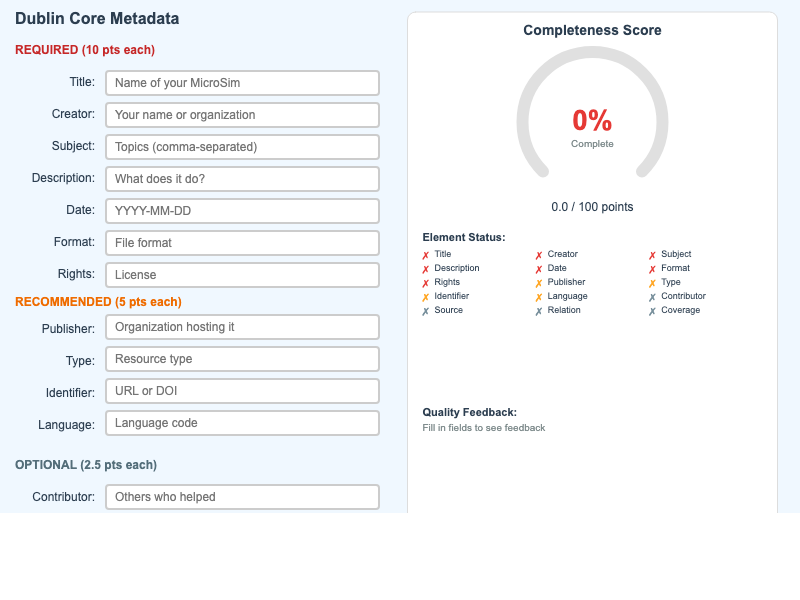

    A MicroSim for implementing and validating Dublin Core metadata completeness in your projects.

- **[Dublin Core Elements](./dublin-core-elements/index.md)**

    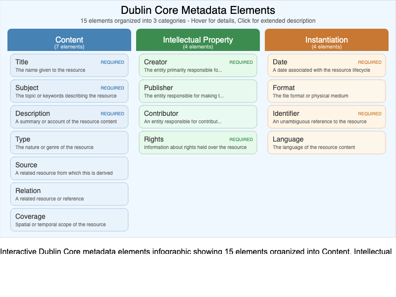

    Interactive infographic showing the 15 Dublin Core metadata elements organized into three categories - Content, Intellectual Property, and Instantiation.

- **[Educational Standards Map](./coverage-world-map/index.md)**

    

    Interactive world map demonstrating how the Dublin Core Coverage element applies differently across global regions with varying educational standards.

- **[Faceted Classification](./faceted-classification/index.md)**

    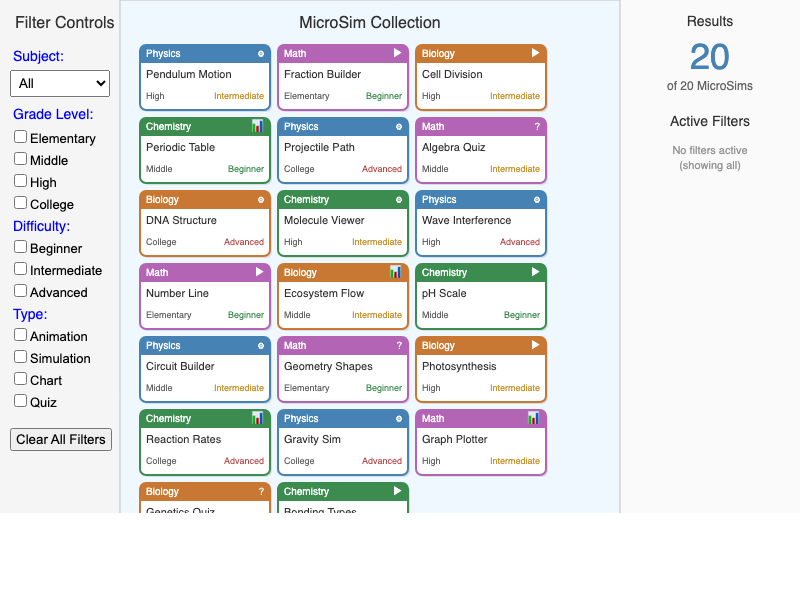

    Interactive demonstration of multi-dimensional classification showing how faceted search filters combine to narrow results across Subject, Grade Level, Difficulty, and Type dimensions.

- **[HTML Architecture](./html-architecture/index.md)**

    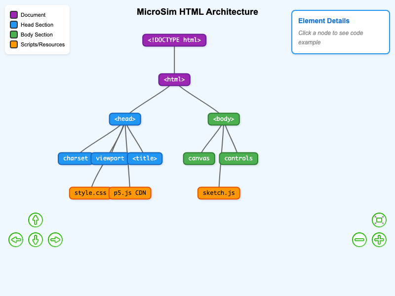

    Interactive diagram showing the structure of a MicroSim's main.html file including head, body, scripts, and how components work together.

- **[Interaction Feedback Loop](./interaction-feedback-loop/index.md)**

    

    Animated diagram showing how interactive learning creates a cognitive feedback cycle between student, MicroSim, and brain processing.

- **[Keyword Search Data Flow](./keyword-search-flow-v1-concept/index.md)**

    

    Static representation of the V1 animation concept, showing why continuous animation failed instructionally for an Understand-level objective.

- **[Keyword Search Flow](./keyword-search-flow/index.md)**

    

    Step-through visualization showing how user search queries are processed through tokenization, keyword matching, and ranking to produce ordered results.

- **[Learning Graph Viewer](./graph-viewer/index.md)**

    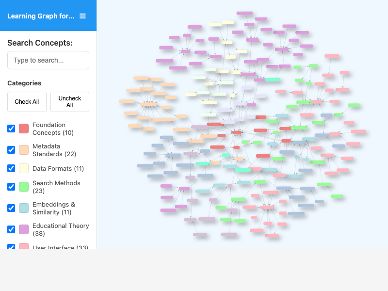

    Interactive viewer to explore the learning graph for the MicroSim Search and Similarity course with search and taxonomy controls.

- **[License Chooser](./cc-license-chooser/index.md)**

    

    Interactive tool to help you select the appropriate Creative Commons license by answering simple questions about commercial use and modifications.

- **[Metadata Schema](./metadata-schema/index.md)**

    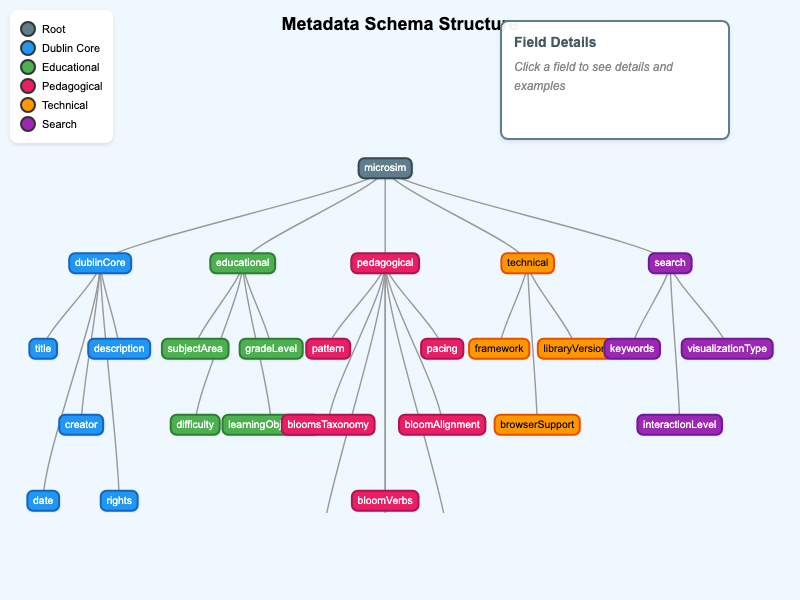

    Interactive diagram showing the hierarchical structure of metadata.json with Dublin Core, educational, pedagogical, technical, and search sections.

- **[MicroSim Directory Structure](./microsim-directory-structure/index.md)**

    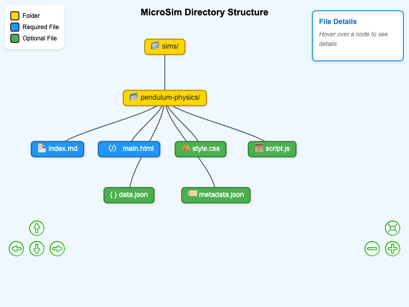

    Interactive diagram showing the standard file organization for MicroSim packages including index.md, main.html, style.css, script.js, and metadata.json files.

- **[MicroSim Search Workflow](./microsim-search-workflow/index.md)**

    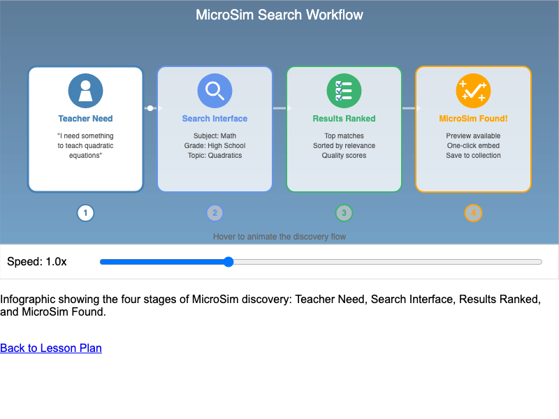

    Infographic showing the four-stage workflow from teacher need to MicroSim discovery through faceted search.

- **[MicroSim Web Architecture](./microsim-web-architecture/index.md)**

    

    Technical diagram showing how MicroSims are embedded in web pages using iframes, with animated HTTP request/response flow.

- **[PCA Similarity Map](./pca-map/index.md)**

    

    Interactive 2D visualization of MicroSim semantic embeddings using Principal Component Analysis, showing clusters by subject area.

- **[Search Workflow](./search-workflow/index.md)**

    

    Interactive workflow diagram showing the complete data pipeline for the MicroSim faceted search system, from crawling GitHub repositories to serving web applications.

- **[Similar MicroSims](./list-similar-microsim/index.md)**

    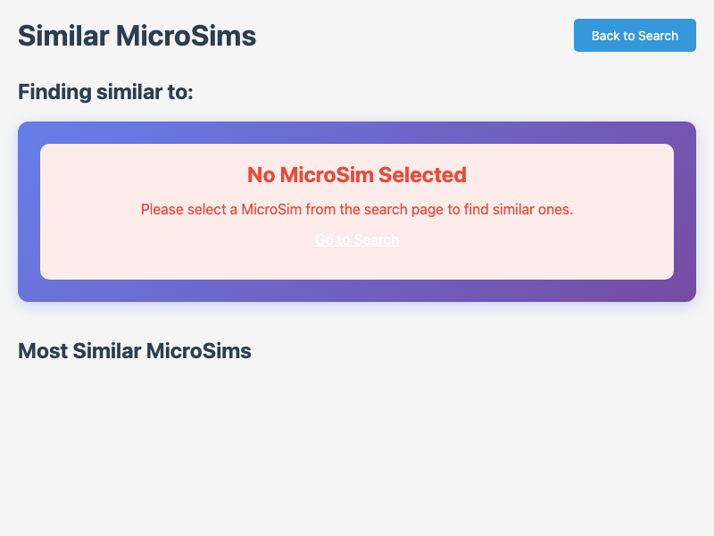

    Find MicroSims that are semantically similar to any given MicroSim using precomputed embeddings and cosine similarity.

- **[Subject Taxonomy Explorer](./subject-taxonomy-explorer/index.md)**

    

    Interactive visualization showing hierarchical relationships between subject disciplines, domains, and topics for Dublin Core metadata classification.

- **[Animation Control Panel](./animation-control-panel/index.md)**

    

    Interactive demonstration of essential animation controls including play, pause, restart, step-through, speed adjustment, and loop toggle with a sample pendulum animation.

- **[Apply-Level Pendulum Calculator](./apply-level-pendulum/index.md)**

    

    Students calculate pendulum period using T = 2π√(L/g), then verify their answer against the simulation. Demonstrates Apply-level (L3) learning with hands-on calculation practice.

- **[Bloom's Taxonomy Pyramid](./blooms-taxonomy-pyramid/index.md)**

    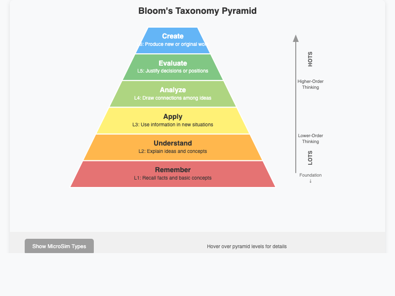

    Interactive pyramid visualization of Bloom's Taxonomy cognitive levels with example verbs, MicroSim types, and detailed descriptions for each level.

- **[Bloom-MicroSim Matcher](./bloom-microsim-matcher/index.md)**

    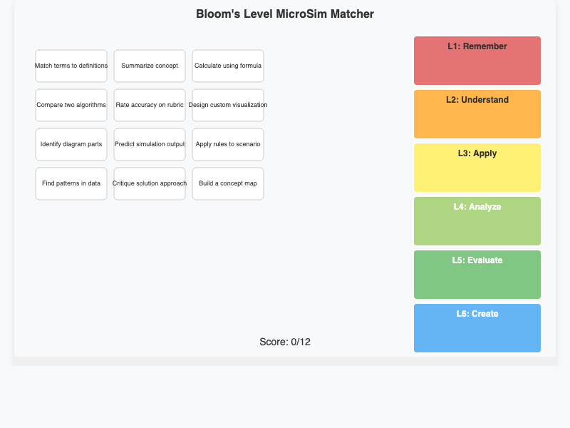

    Drag-and-drop matching activity where students connect MicroSim types to their appropriate Bloom's Taxonomy levels with immediate feedback.

- **[Cognitive Load Visualizer](./cognitive-load-visualizer/index.md)**

    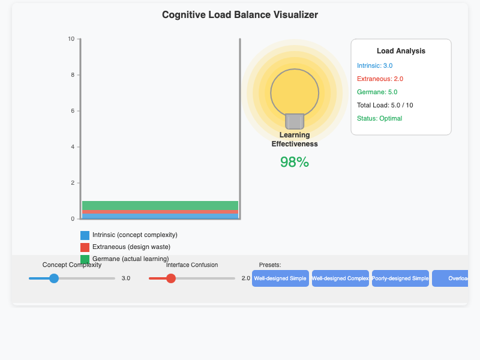

    Beaker visualization demonstrating cognitive load theory with three liquid types representing intrinsic, extraneous, and germane load affecting learning capacity.

- **[Dashboard Layout Builder](./dashboard-patterns/index.md)**

    

    Drag-and-drop tool for constructing effective dashboard layouts by selecting and arranging components on a grid canvas with preset templates.

- **[Feedback Loop Comparison](./feedback-loop-sim/index.md)**

    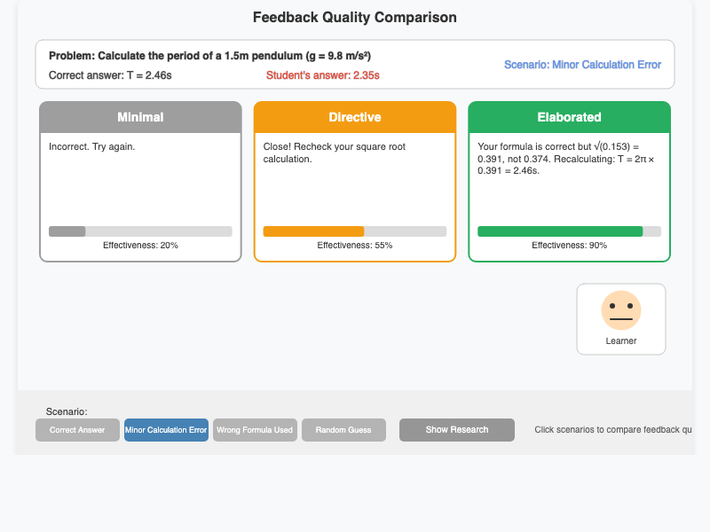

    Three-panel comparison of feedback styles (minimal, directive, elaborated) across different error scenarios showing effectiveness percentages and research findings.

- **[Grade Level Progression](./grade-level-progression/index.md)**

    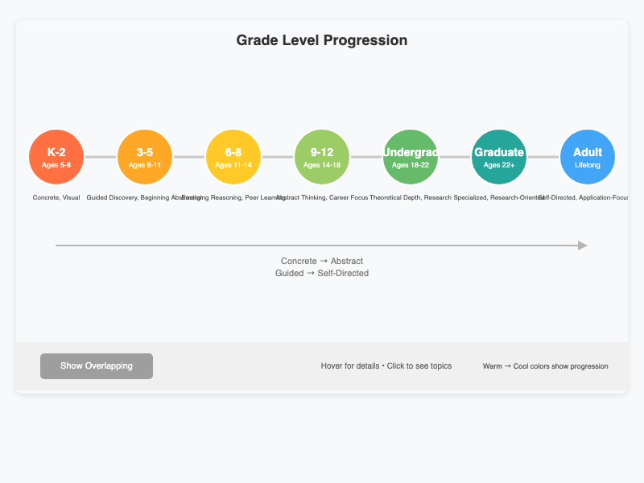

    Visual timeline showing characteristics of educational content across grade levels from elementary through graduate, with reading level and complexity indicators.

- **[Graph Layout Gallery](./graph-viz-gallery/index.md)**

    

    Gallery of five graph layout algorithms (Force-Directed, Hierarchical, Circular, Radial, Grid) showing the same data rendered in each style with descriptions.

- **[Guided Discovery Path](./guided-discovery-path/index.md)**

    

    Nine-step interactive workflow showing the guided discovery learning process from initial question through scaffolded exploration to knowledge transfer.

- **[Learning Theories Comparison](./learning-theories-compare/index.md)**

    

    Four-quadrant comparison of major learning theories (Constructivism, Behaviorism, Cognitivism, Experiential) with central design challenge integration.

- **[Rubric Scorer](./rubric-scorer/index.md)**

    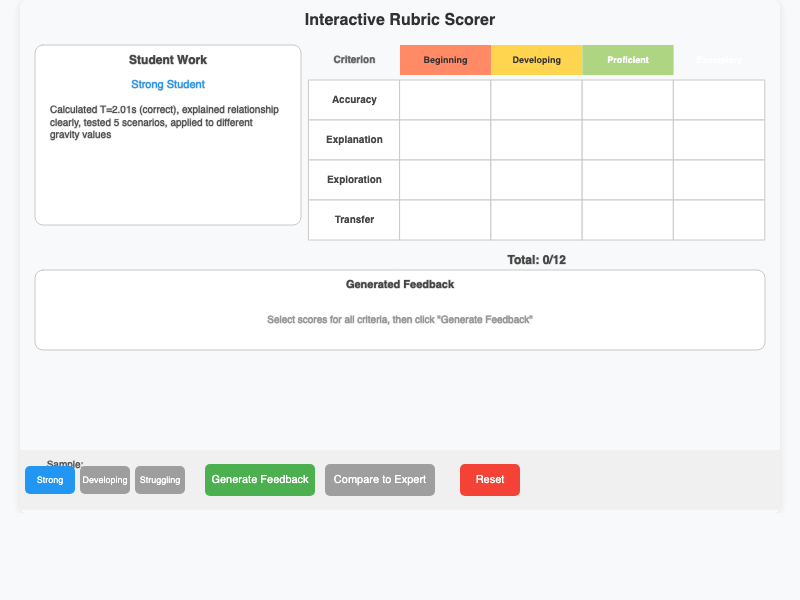

    Interactive rubric assessment tool where students evaluate work samples using criteria and compare their scores against expert assessment.

- **[Simulation Anatomy](./simulation-anatomy/index.md)**

    

    Annotated diagram showing the five essential regions of an educational simulation interface: Visualization, Control Panel, Information, Title, and Help.

- **[Standards Comparison](./standards-comparison/index.md)**

    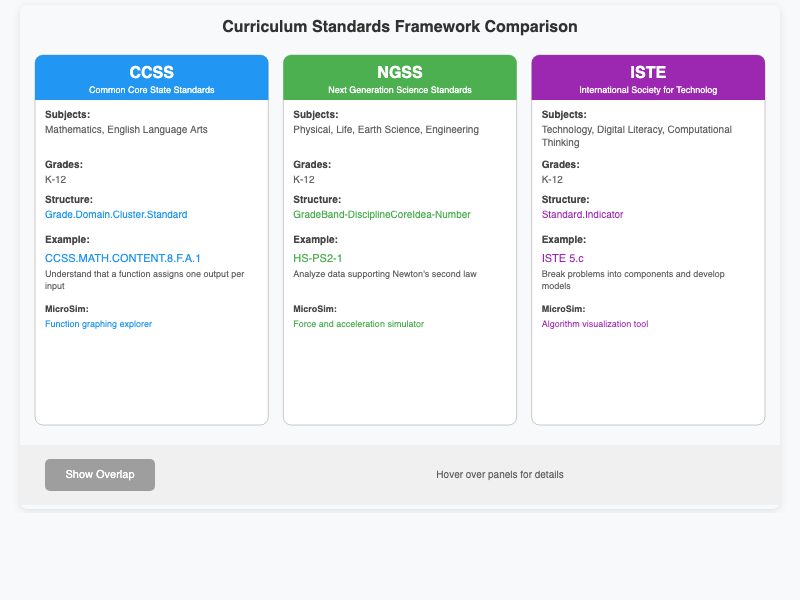

    Side-by-side comparison of educational standards frameworks (Common Core, NGSS, ISTE, state standards) with feature analysis and recommendations.

- **[Timeline Layout Styles](./timeline-styles/index.md)**

    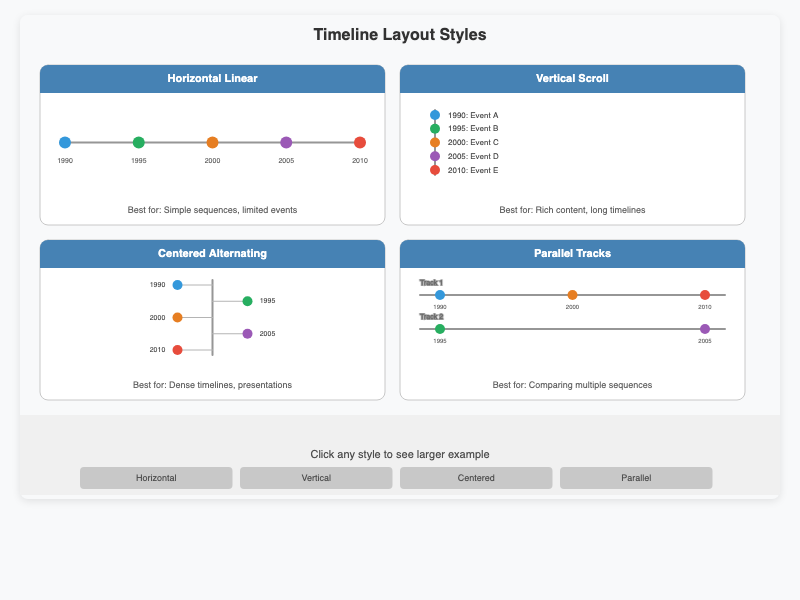

    Comparison of four timeline visualization styles (Horizontal Linear, Vertical Scroll, Centered Alternating, Parallel Tracks) with the same event data.

